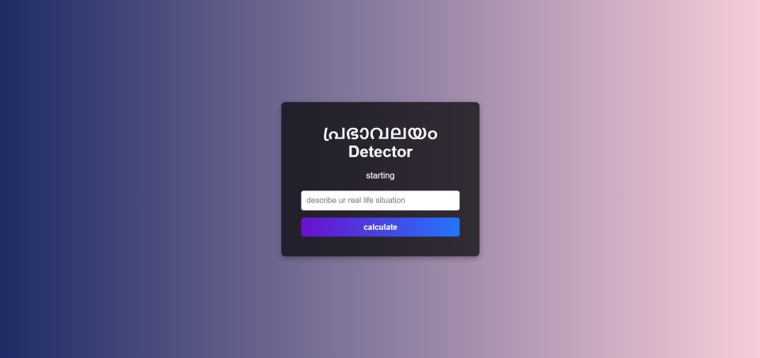
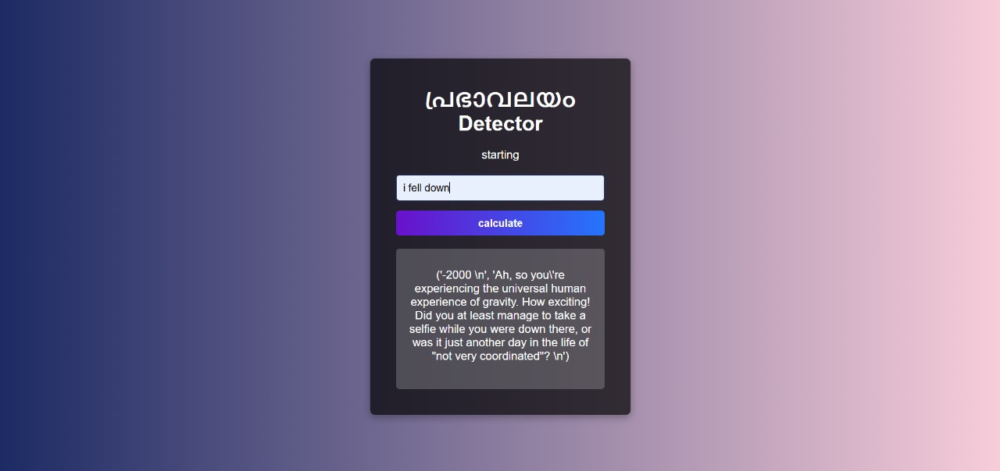
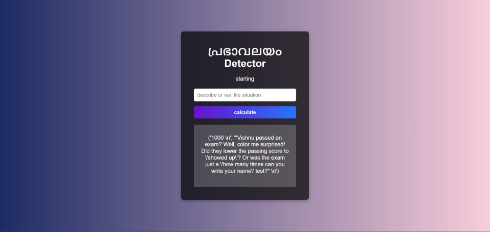
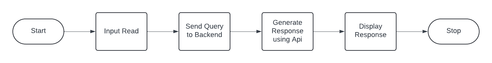

# Prabhavalayam Detector 🎯

## Project URL
[https://v4sud3v.pythonanywhere.com/](https://v4sud3v.pythonanywhere.com/)

### Note on API Response Time
Please note that the application makes API calls to the Gemini model for generating aura values and responses. As a result, the response time may vary depending on several factors, including:

- **API rate limits**: If the system has exceeded its request quota, responses may be delayed.
- **API server load**: Performance may vary depending on the current load on the external API servers.
- **Internet connection**: A slower network connection may impact the time taken for the API to respond.

We recommend waiting a few moments for the results to be generated. If the page does not load or is taking longer than expected, please try again after some time.

## Basic Details

### Team Name: 3case

### Team Members

- Team Lead: C.R Vasudev Varma - SCMS School of Engineering and Technology
- Member 2: Johan Biju Paul - SCMS School of Engineering and Technology
- Member 3: Jopaul Jose - SCMS School of Engineering and Technology

### Project Description
പ്രഭാവലയം Detector is a web application designed to detect the "aura" of a user-defined real-life situation, delivering a numerical value based on the user's input. The app integrates with Google's Gemini API to process text inputs and provides a straightforward numerical result, capturing the aura of the described scenario.

Features
User Input Form: Allows users to describe their real-life situations.
Aura Detection: Processes the input through the Gemini API and returns a unique aura value, calculated based on the user's description.
Error Handling: Provides clear feedback if the input is invalid or if an error occurs.
Intuitive UI: A visually appealing and simple user interface with a responsive design and gradient theme.
Tech Stack
Frontend: HTML, CSS
Backend: Python, Flask
Generative AI API: Google Gemini
Usage
Start the Flask server and open the app in your browser.
Describe a real-life situation in the input form and submit it.
View the aura result, which is a number ranging between ±1 and ±10000, representing the aura based on the situation described.

### The Problem (that doesn't exist)

Lack of Aura Visualization or Quantifying

### The Solution (that nobody asked for)

Welcome to പ്രഭാവലയം Detector—the app that reads between the lines of your life’s weirdest, wildest, or most mundane moments and assigns them a mystical aura value! Whether you just spilled coffee on your shirt before a big meeting or you’re having an existential crisis in line at the grocery store, AuraDetector1’s got you. Enter your situation, and it gives you a unique aura score, letting you know just how "vibey" your life is today.

## Technical Details

### Technologies/Components Used

For Software:

- python
- flask
- google-generativeai
- vs code,github,gitbash

### Implementation

For Software:

# Installation

[

pip install flask
pip install google-generativeai
]

# Run

flask run

### Project Documentation

For Software:

# Screenshots (Add at least 3)

The default page you reach after loading the website.

A case which shows negative aura detection after entering a user scneario.

A case which shows positive aura detection after entering a user scneario.

# Diagrams

1.Start

2.The user accesses the web application.
User Input Form

3.The user enters a real-life situation in the text input field on the homepage and submits it.
Send Query to Backend

4.The form data (user's situation description) is sent to the Flask backend.
Generate Response Using Gemini API

5.The backend function get_opposing_reasons formats the user’s query, then sends it to the Gemini API for processing.
Gemini API returns two types of responses: one for the aura value and one for roasting the situation.
Display Response

6.The response from the Gemini API is rendered on the index.html page.
If there’s an error, an error message is displayed instead.

7.End
The user sees the response (aura value and optional roast) on the webpage.

### Project Demo

# Video

<video width="400" controls>
  <source src="static/aura_working.mp4" type="video/mp4">
</video>

Made with ❤️ at TinkerHub Useless Projects

